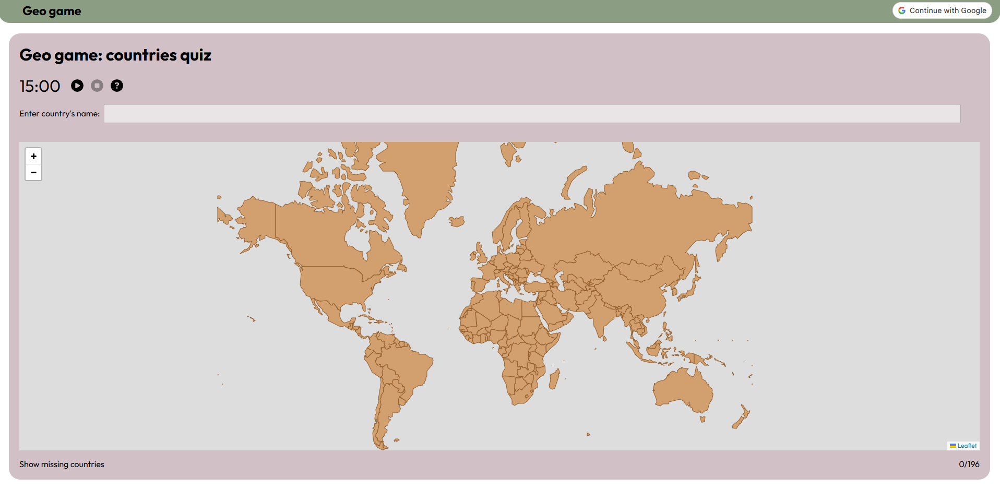

# 🌍 Geo Game: Countries Quiz

A web-based quiz game where users test how many countries they can name. As correct answers are entered, the map dynamically fills in, providing a visual sense of progress.

[Inspired by a uiz on JetPunk](https://www.jetpunk.com/quizzes/how-many-countries-can-you-name).

---

## 🚀 Live Demo

[Play the game](https://jolantalachman.github.io/geo-game/#/start)

---

## 📸 Preview

---

## 📖 Detailed Description

This game challenges players to correctly name every country as quickly as possible. It includes:

* Timed rounds
* Progress tracking and scoring
* Leaderboards and analytics
* User authentication (Google OAuth + JWT)
* Persistent result storage

### 🧱 Architecture

* **Backend:** ASP.NET Core Web API

* **Frontend:** Angular Single Page Application

---

## ✨ Features

* ⏱️ Timed rounds
* 👤 Player profiles, session history, and personal best tracking
* 🏆 Leaderboards and game analytics with pagination
* 🛠️ Admin dashboard for user management
* 🔐 Authentication (Google OAuth + JWT) with role-based access
* 🌍 Interactive world map highlighting correctly guessed countries

---

## 🎮 How to Play

1. Start a new game session
2. Type country names as fast as possible
3. Each correct answer highlights the country on the map
4. Try to complete all countries in the shortest time

---

## 📈 Future Improvements

* 🌐 Multiplayer or competitive mode
* 📱 Enhanced mobile experience
* 🧠 Alternative quiz modes (continents, flags, capitals)
* 🎨 UI/UX improvements and animations
